# 管理员功能设计图

本文档是针对校园问卷投票系统 **管理员功能** 的增量设计图，需与 `design-diagrams.md` 配合阅读。

## 1. ER 图（更新）

新增字段已在图中标出。

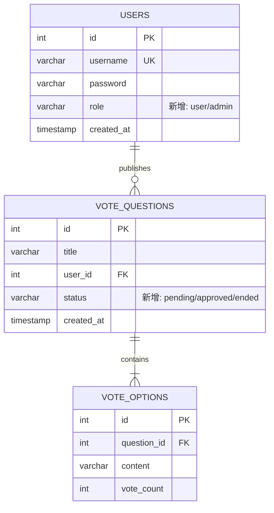

## 2. 问卷状态流转图

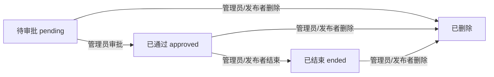

## 3. 用例图（更新）

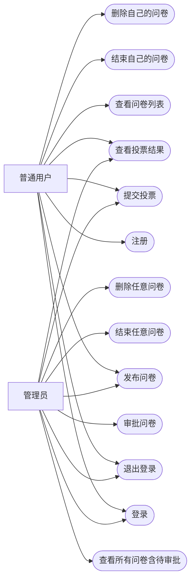

## 4. 类图（更新）

仅展示变更部分，新增字段用注释标记。

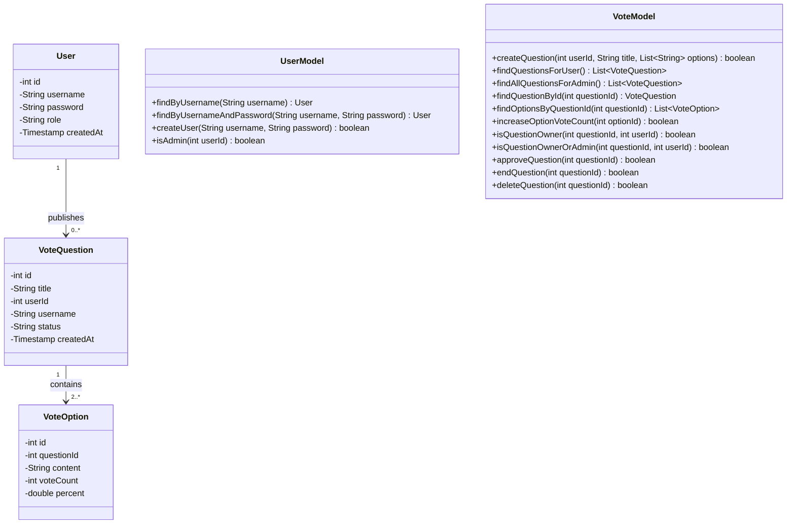

## 5. Servlet 类图（更新）

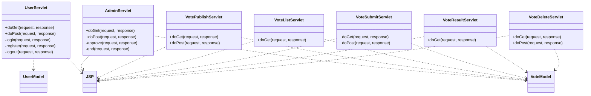

## 6. 发布问卷流程图（更新）

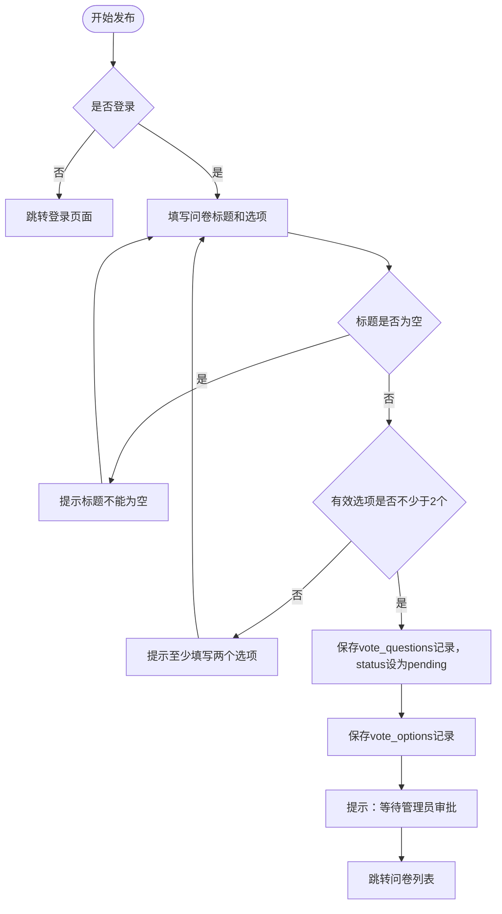

## 7. 审批流程图（新增）

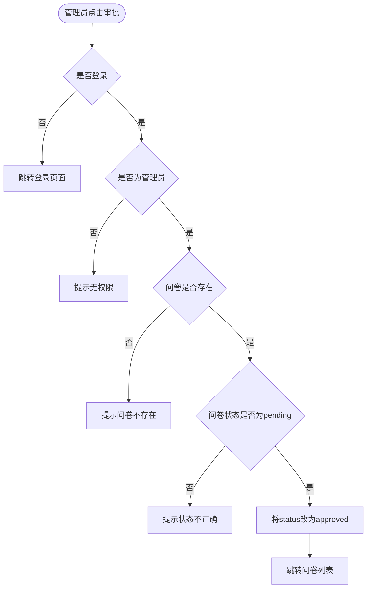

## 8. 结束问卷流程图（新增）

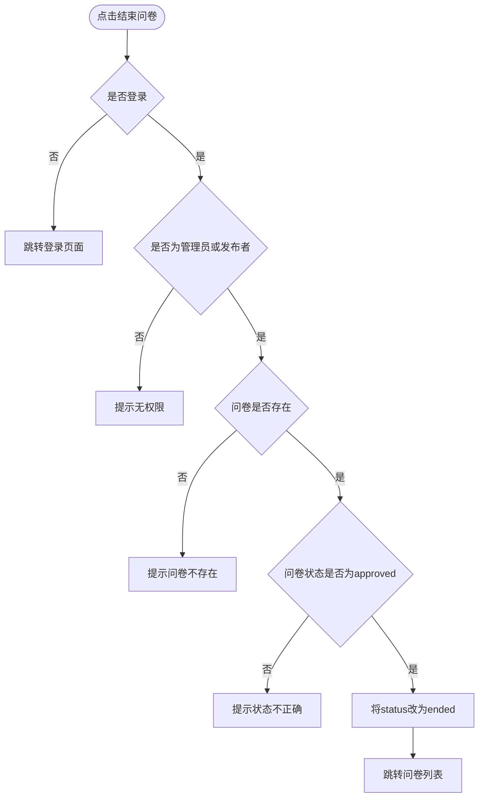

## 9. 删除流程图（更新）

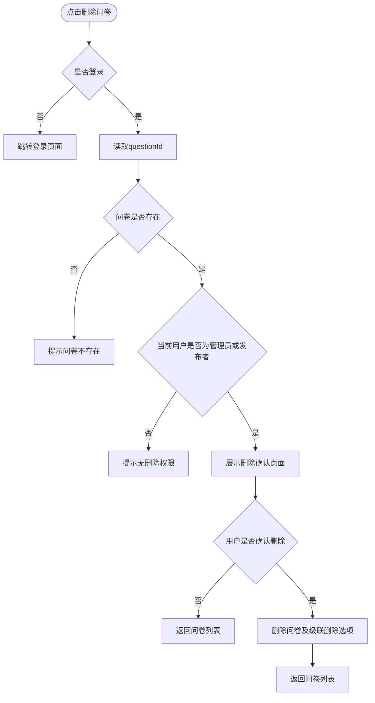

## 10. 管理员审批时序图（新增）

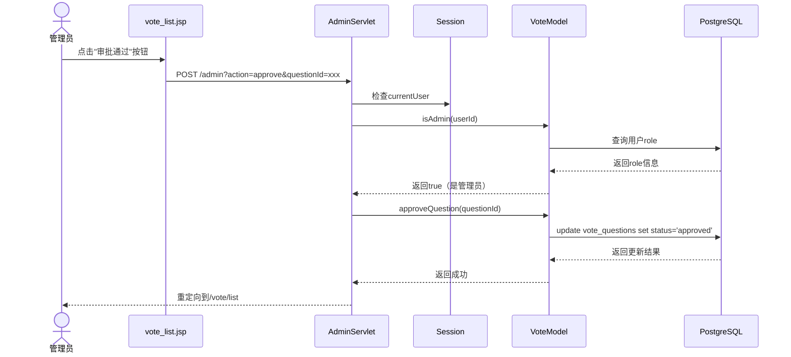

## 11. 结束问卷时序图（新增）

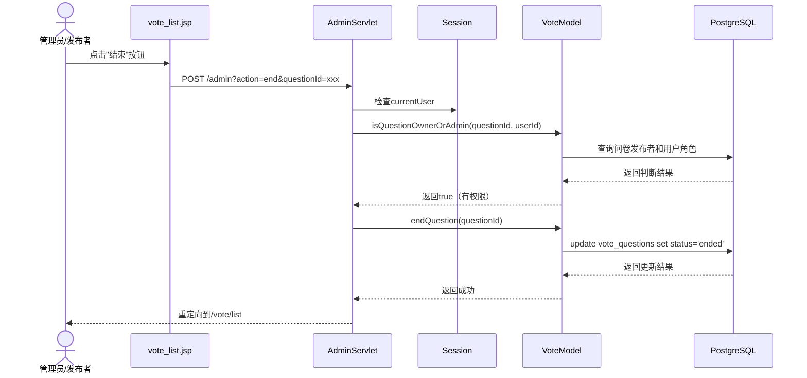

## 12. 设计变更总结

| 变更项 | 变更类型 | 说明 |
|---|---|---|
| `users` 表新增 `role` 字段 | 数据库 | 区分 user/admin |
| `vote_questions` 表新增 `status` 字段 | 数据库 | 标记 pending/approved/ended |
| `User` 实体新增 `role` 字段 | 实体类 | 对应数据库 |
| `VoteQuestion` 实体新增 `status` 字段 | 实体类 | 对应数据库 |
| `UserModel.isAdmin()` | 新增方法 | 判断管理员身份 |
| `VoteModel` 查询方法变更 | 变更方法 | 区分用户/管理员视角 |
| `VoteModel.approveQuestion()` | 新增方法 | 审批通过 |
| `VoteModel.endQuestion()` | 新增方法 | 结束问卷 |
| `VoteModel.isQuestionOwnerOrAdmin()` | 新增方法 | 权限判断 |
| `AdminServlet` | 新增 Servlet | `/admin`，处理审批和结束 |
| `VotePublishServlet` | 变更 | 发布时设置 pending 状态 |
| `VoteListServlet` | 变更 | 区分用户/管理员查询 |
| `VoteSubmitServlet` | 变更 | 增加状态校验 |
| `VoteDeleteServlet` | 变更 | 权限放宽至管理员 |
| `vote_list.jsp` | 变更 | 区分用户/管理员 UI |
| `vote_submit.jsp` | 变更 | 已结束状态显示 |
| `vote_publish.jsp` | 变更 | 提示文案变更 |
