# 校园问卷投票系统设计图

本文档用于补充概要设计中的图形化说明，所有图均使用 Mermaid 编写，方便在支持 Mermaid 的 Markdown 工具中直接预览。

本系统是简单课程设计版本，主要围绕以下核心对象展开：

- 用户：负责注册、登录、发布问卷、投票、查看结果、删除自己的问卷。
- 问卷：表示一个投票题目。
- 选项：表示某个问卷下可选择的投票项，并保存当前票数。

## 1. ER 图

ER 图用于说明数据库中表与表之间的关系。

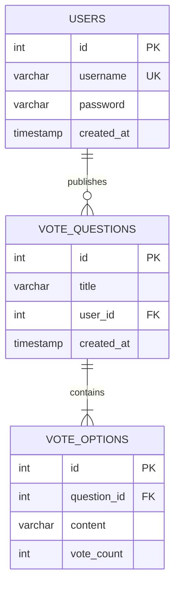

关系说明：

- 一个用户可以发布多个问卷。
- 一个问卷只能属于一个发布用户。
- 一个问卷必须包含多个选项。
- 一个选项只能属于一个问卷。
- 删除问卷时，该问卷下的选项一并删除。

## 2. 数据表关系图

该图更接近数据库表结构，重点展示主键、外键和字段类型。

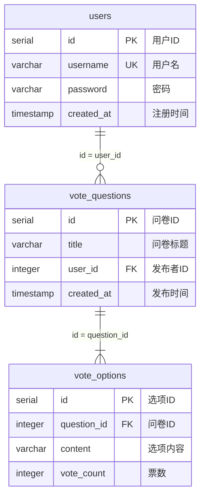

## 3. 类图

类图用于说明 Java 代码中的主要类、字段、方法和依赖关系。

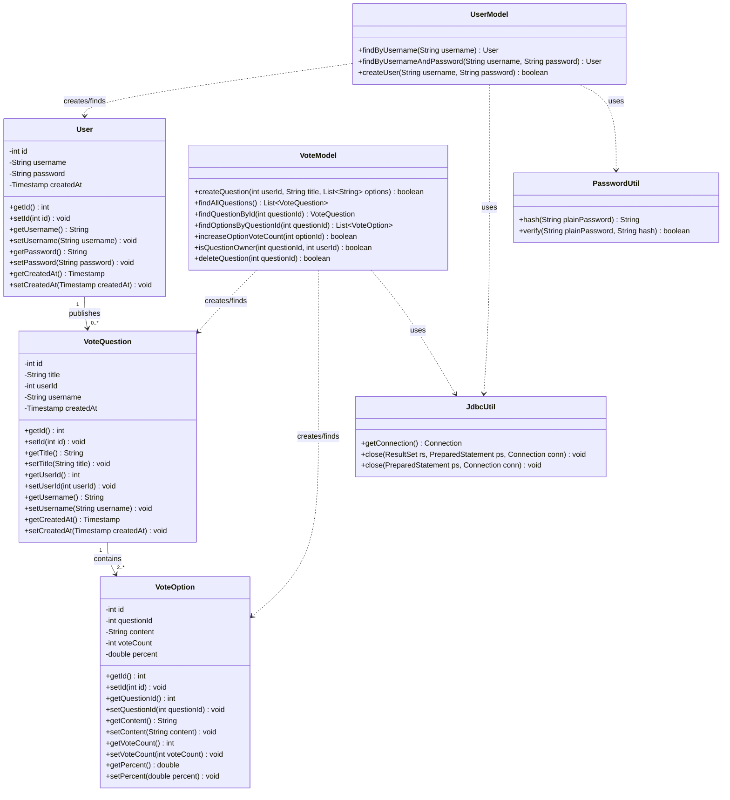

## 4. Servlet 控制类图

该图展示 Servlet、Model 和 JSP 的协作关系。

```mermaid
classDiagram
    class UserServlet {
        +doGet(HttpServletRequest request, HttpServletResponse response) void
        +doPost(HttpServletRequest request, HttpServletResponse response) void
        -login(request, response) void
        -register(request, response) void
        -logout(request, response) void
    }

    class VotePublishServlet {
        +doGet(HttpServletRequest request, HttpServletResponse response) void
        +doPost(HttpServletRequest request, HttpServletResponse response) void
    }

    class VoteListServlet {
        +doGet(HttpServletRequest request, HttpServletResponse response) void
    }

    class VoteSubmitServlet {
        +doGet(HttpServletRequest request, HttpServletResponse response) void
        +doPost(HttpServletRequest request, HttpServletResponse response) void
    }

    class VoteResultServlet {
        +doGet(HttpServletRequest request, HttpServletResponse response) void
    }

    class VoteDeleteServlet {
        +doGet(HttpServletRequest request, HttpServletResponse response) void
        +doPost(HttpServletRequest request, HttpServletResponse response) void
    }

    class UserModel
    class VoteModel
    class JSP

    UserServlet ..> UserModel : calls
    VotePublishServlet ..> VoteModel : calls
    VoteListServlet ..> VoteModel : calls
    VoteSubmitServlet ..> VoteModel : calls
    VoteResultServlet ..> VoteModel : calls
    VoteDeleteServlet ..> VoteModel : calls

    UserServlet ..> JSP : forwards
    VotePublishServlet ..> JSP : forwards
    VoteListServlet ..> JSP : forwards
    VoteSubmitServlet ..> JSP : forwards
    VoteResultServlet ..> JSP : forwards
    VoteDeleteServlet ..> JSP : forwards
```

## 5. 用例图

用例图用于说明用户可以完成哪些系统功能。

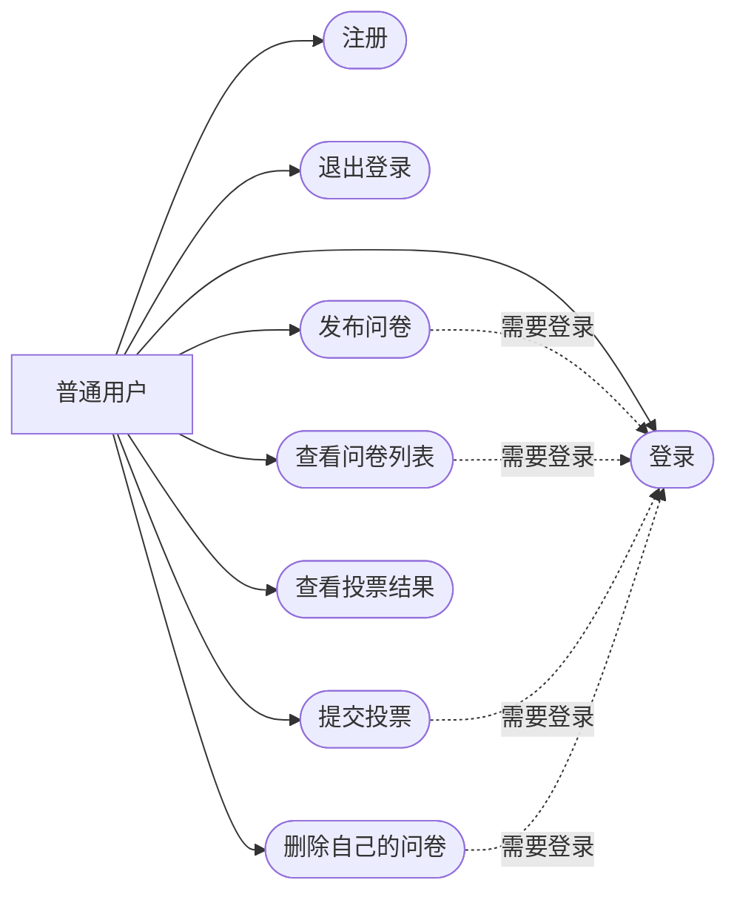

说明：

- Mermaid 没有标准 UML 用例图语法，因此这里使用流程图语法模拟用例图。
- 系统不单独设计管理员角色。

## 6. 系统总体流程图

该图展示用户从进入系统到完成主要操作的总体流程。

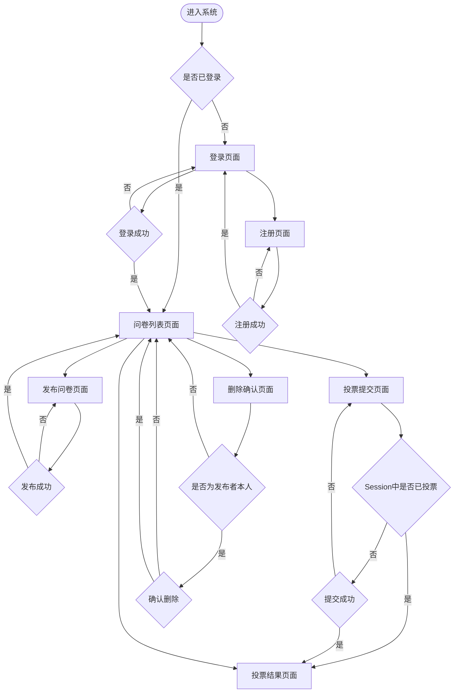

## 7. 注册登录流程图

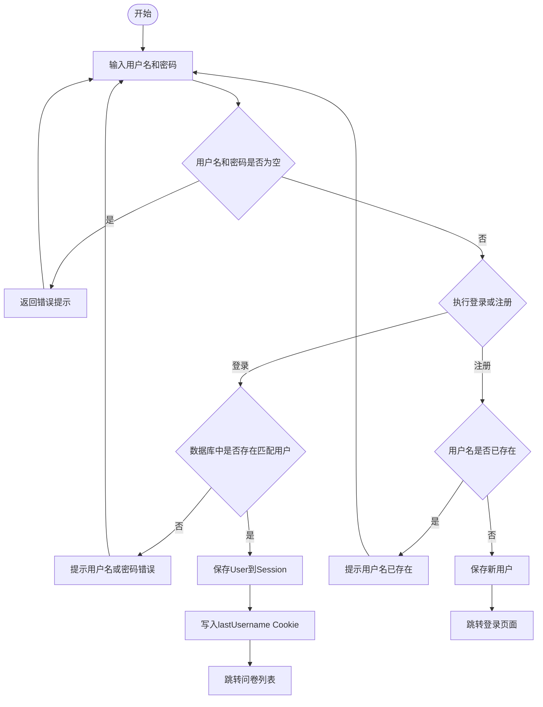

## 8. 发布问卷流程图

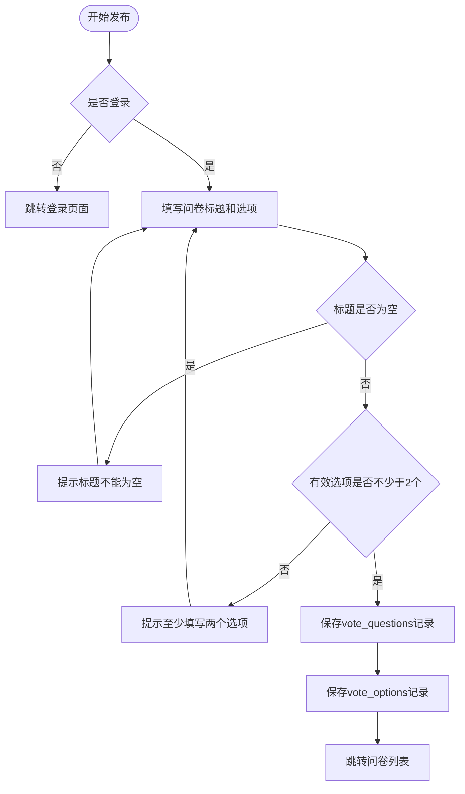

## 9. 投票与防重复投票流程图

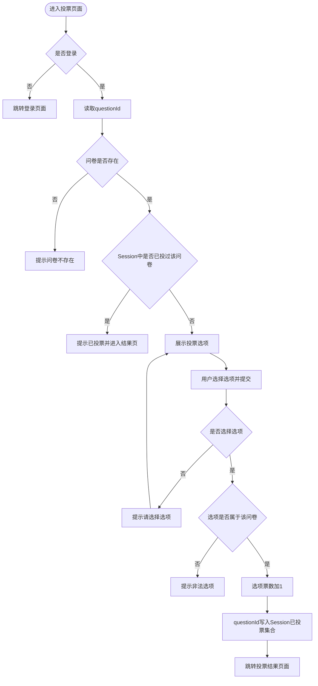

## 10. 删除问卷流程图

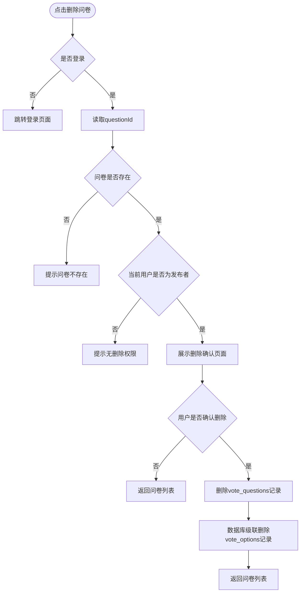

## 11. 登录时序图

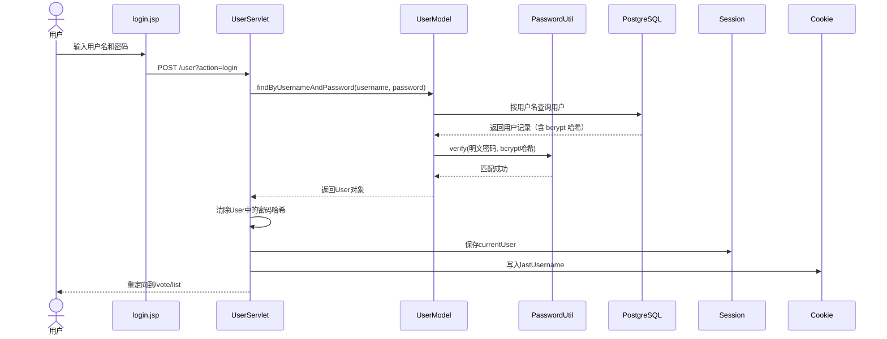

## 12. 投票提交时序图

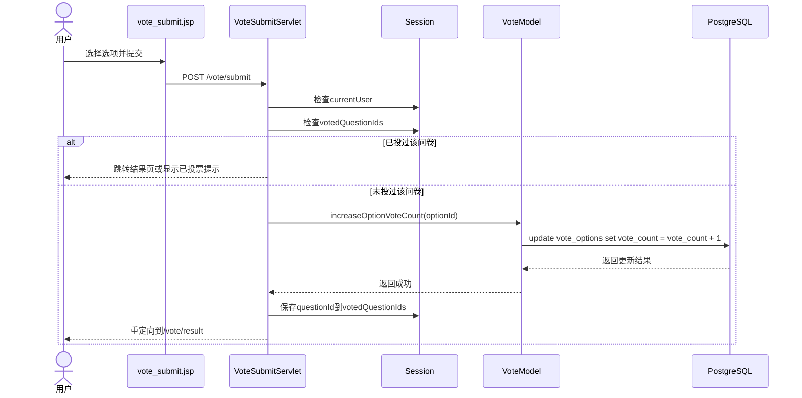

## 13. 发布问卷时序图

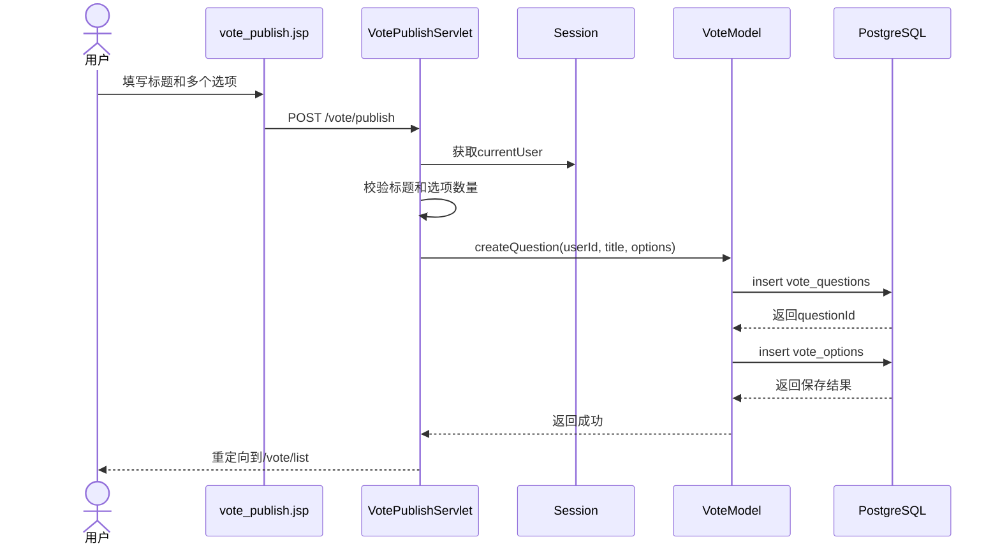

## 14. 删除问卷时序图

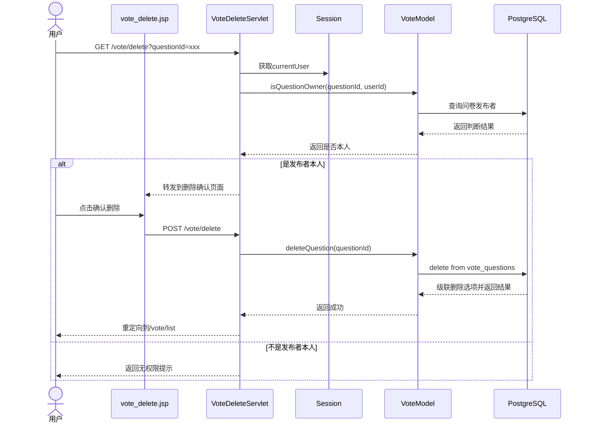

## 15. MVC 请求处理图

该图展示一次典型请求在 MVC 中的流转方式。

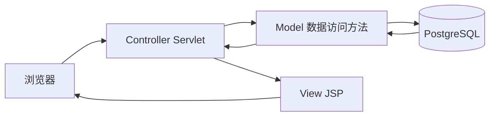

说明：

- 浏览器只访问 Servlet 或 JSP 页面。
- Servlet 负责判断登录状态、校验参数、调用 Model。
- Model 负责执行 SQL。
- JSP 只展示 Servlet 放入 request 中的数据。

## 16. 设计约束总结

- 系统只设计普通用户角色。
- 一个问卷只包含一个投票题目。
- 一个投票题目至少包含两个选项。
- 防重复投票使用 Session 实现。
- Cookie 只保存最近登录用户名，不保存密码。
- 删除问卷时只允许发布者本人操作。
- JSP 不直接访问数据库。
- 代码实现阶段不引入复杂框架，保持 Servlet + JSP + JDBC。
